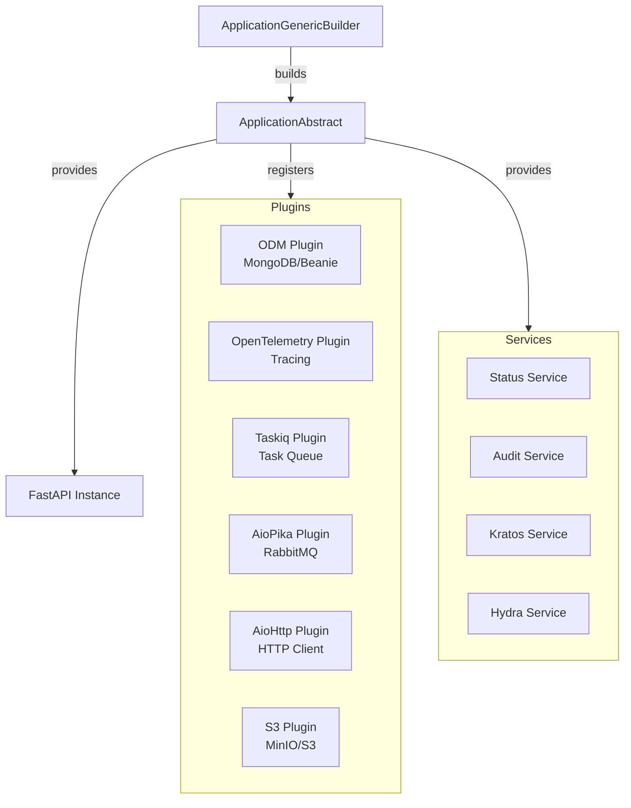

# FastAPI Factory Utilities

[](https://www.python.org/downloads/)
[](https://opensource.org/licenses/MIT)
[](https://github.com/DeerHide/fastapi_factory_utilities)

**A comprehensive library to build production-ready microservices with FastAPI, Beanie, Taskiq, AioPika, and OpenTelemetry.**

This library consolidates common patterns, plugins, and utilities for creating modern Python microservices with observability, security, and message-driven architectures built-in from the start.

---

## 📚 Documentation

| Document | Description |
|----------|-------------|
| **[Documentation Index](docs/knowledge/index.md)** | Master navigation for all documentation |
| [Project Overview](docs/knowledge/project-overview.md) | Executive summary and tech stack |
| [Architecture](docs/knowledge/architecture.md) | Technical architecture reference with diagrams |
| [Architecture Decisions](docs/planning-artifacts/architecture.md) | Formal architectural decisions and implementation patterns |
| [Source Tree](docs/knowledge/source-tree-analysis.md) | Annotated directory structure |
| [Development Guide](docs/knowledge/development-guide.md) | Setup, testing, and contribution guide |
| [Agent Skill](SKILL.md) | Points to canonical skill in DeerHide/agent_skills |

---

## Features

### 🏗️ Application Framework
- **Abstract Application Builder** with plugin architecture for composable microservices
- **Configuration Management** using YAML files and environment variables
- **Environment-aware** configuration (development, staging, production)
- **Lifecycle Management** with startup/shutdown hooks

> 📖 See [Architecture Documentation](docs/knowledge/architecture.md#core-components) for detailed component design.

### 🔐 Security & Authentication
- **JWT Bearer Authentication** with token verification and decoding
- **Ory Kratos Integration** for identity and user management
- **Ory Hydra Integration** for OAuth2 and OpenID Connect flows
- **Flexible Authentication** with custom JWT verifiers and JWK stores

> 📖 See [Security Architecture](docs/knowledge/architecture.md#security-architecture) for authentication flows.

### 🗄️ Database & ODM
- **Beanie ODM Plugin** for MongoDB with async operations
- **Document Models** with Pydantic v2 validation
- **Repository Pattern** support for clean architecture

> 📖 See [Data Architecture](docs/knowledge/architecture.md#data-architecture) for repository patterns.

### 📨 Message Broker & Task Queue
- **AioPika Plugin** for RabbitMQ message broker integration
- **Taskiq Plugin** for distributed task queue with Redis backend
- **S3 Plugin** for MinIO / S3 via async aioboto3 (named buckets + DI)
- **Message-Driven Architecture** support with async consumers/producers

> 📖 See [Plugin Architecture](docs/knowledge/architecture.md#plugin-architecture) for plugin details.

### 📊 Observability & Monitoring
- **OpenTelemetry Plugin** with automatic instrumentation for:
  - FastAPI endpoints
  - MongoDB operations
  - HTTP client requests (aiohttp)
  - RabbitMQ messaging (AioPika)
- **Distributed Tracing** with OTLP exporters (HTTP/gRPC)
- **Structured Logging** with structlog integration
- **Status Endpoint** for health checks and monitoring

> 📖 See [Observability Architecture](docs/knowledge/architecture.md#observability-architecture) for tracing setup.

### 🌐 HTTP Client
- **AioHttp Plugin** with OpenTelemetry instrumentation
- **Async HTTP operations** with connection pooling
- **Automatic tracing** of outbound HTTP requests

### 🛠️ Services
- **Status Service** - Health check endpoints with reactive monitoring
- **Audit Service** - Event auditing capabilities
- **Kratos Service** - Identity management operations
- **Hydra Service** - OAuth2/OIDC operations

> 📖 See [Service Layer](docs/knowledge/architecture.md#service-layer) for service details.

---

## Requirements

- **Python:** >= 3.12
- **Mandatory:** FastAPI, Pydantic, structlog, Uvicorn, aiohttp, PyJWT
- **Extras:** Beanie/PyMongo (`mongo`), AioPika (`amqp`), aioboto3 (`s3`), Redis (`redis`), Taskiq Redis broker (`taskiq`), OpenTelemetry SDK (`otel`)

> 📖 See [Project Overview](docs/knowledge/project-overview.md#technology-stack-summary) for complete dependency list.

---

## Installation

### Using pip

```bash
pip install fastapi-factory-utilities
# Backing technologies are extras:
pip install 'fastapi-factory-utilities[mongo,otel]'
pip install 'fastapi-factory-utilities[all]'
```

### Using Poetry

```bash
poetry add fastapi-factory-utilities
poetry add fastapi-factory-utilities --extras mongo --extras otel
```

Extras: `mongo`, `amqp`, `s3`, `redis`, `taskiq`, `otel`, `all` — declared in `pyproject.toml`. Importing a plugin without its extra raises `MissingExtraError` naming the extra to install. The bundled ASGI server is Uvicorn.

---

## Public API and deprecation

A symbol is **public** if and only if it is listed in a package `__init__.__all__`. Import it from that package, not from the defining submodule. Everything else — module paths, module names, class internals — is private and may move in a minor release without a shim.

**Which exceptions module.** `fastapi_factory_utilities.core.exceptions` is the library error base (`FastAPIFactoryUtilitiesError`). `fastapi_factory_utilities.core.utils.exceptions` is the mapping decorator (`ExceptionMapping`, `ExceptionMappingContext`).

**SemVer**

- Breaking: removing or renaming a symbol in an `__all__`; removing an extra; raising the minimum Python.
- Adding a public symbol, or moving a private module, is a minor or patch.

**Deprecation**

A public removal first ships a `DeprecationWarning` that names the replacement, is held for at least one minor, and is removed no earlier than the next major. The CHANGELOG states the removal version. A deprecation with live consumers is either migrated or withdrawn — it is not left warning indefinitely.

Plugins that open an external connection accept that client (or its factory) as an optional constructor argument. Do not monkeypatch FFU internals.

---

## Quick Start

Here's a minimal example to create a microservice with MongoDB and OpenTelemetry:

```python
from typing import ClassVar
from beanie import Document
from fastapi_factory_utilities.core.app import (
    ApplicationAbstract,
    ApplicationGenericBuilder,
    RootConfig,
)
from fastapi_factory_utilities.core.plugins import PluginAbstract
from fastapi_factory_utilities.core.plugins.odm_plugin import ODMPlugin
from fastapi_factory_utilities.core.plugins.opentelemetry_plugin import OpenTelemetryPlugin


class MyAppConfig(RootConfig):
    """Custom application configuration."""
    pass


class MyApp(ApplicationAbstract):
    """Your microservice application."""

    CONFIG_CLASS: ClassVar[type[RootConfig]] = MyAppConfig
    PACKAGE_NAME: ClassVar[str] = "my_app"
    ODM_DOCUMENT_MODELS: ClassVar[list[type[Document]]] = []

    def configure(self) -> None:
        """Configure your application routes and middleware."""
        # Add your API routers here
        pass

    async def on_startup(self) -> None:
        """Actions to perform on application startup."""
        pass

    async def on_shutdown(self) -> None:
        """Actions to perform on application shutdown."""
        pass


class MyAppBuilder(ApplicationGenericBuilder[MyApp]):
    """Application builder."""

    def get_default_plugins(self) -> list[PluginAbstract]:
        """Get the default plugins."""
        return [
            ODMPlugin(),
            OpenTelemetryPlugin(),
        ]

    def __init__(self, plugins: list[PluginAbstract] | None = None) -> None:
        """Initialize the builder."""
        if plugins is None:
            plugins = self.get_default_plugins()
        super().__init__(plugins=plugins)


# Build and run your application
if __name__ == "__main__":
    MyAppBuilder().build_and_serve()
```

Create an `application.yaml` configuration file in your package:

```yaml
application:
  service_namespace: "my-company"
  service_name: "my-app"
  description: "My awesome microservice"
  version: "1.0.0"
  environment: "development"

server:
  host: "0.0.0.0"
  port: 8000

# CORS is opt-in: omit this block (or leave allow_origins empty) to disable it.
# Never combine allow_origins: ["*"] with allow_credentials: true.
cors:
  allow_origins: ["https://app.example"]
  allow_credentials: true
  allow_methods: ["*"]
  allow_headers: ["*"]
```

> 📖 See [Architecture - Configuration System](docs/knowledge/architecture.md#configuration-system) for complete configuration options.

---

## Core Components

### Application Framework

The `ApplicationAbstract` class provides the foundation for your microservice:

- **Plugin System**: Extend functionality through composable plugins
- **Configuration**: Type-safe configuration with Pydantic models
- **Lifecycle Management**: Control startup and shutdown behavior
- **FastAPI Integration**: Built-in FastAPI application with customizable routes

The `ApplicationGenericBuilder` handles:
- Configuration loading from YAML files
- Plugin initialization and registration
- FastAPI application setup
- Uvicorn server management

> 📖 See [Architecture - Core Components](docs/knowledge/architecture.md#core-components) for detailed class documentation.

### Available Plugins

Each plugin extends your application with specific capabilities:

| Plugin | Purpose | Documentation |
|--------|---------|---------------|
| **`ODMPlugin`** | MongoDB operations with Beanie ODM | [Plugin Details](docs/knowledge/architecture.md#plugin-implementation-example-odmplugin) |
| **`OpenTelemetryPlugin`** | Distributed tracing and metrics | [Observability](docs/knowledge/architecture.md#observability-architecture) |
| **`TaskiqPlugin`** | Background task processing with Redis | [Plugin Architecture](docs/knowledge/architecture.md#available-plugins) |
| **`AioPikaPlugin`** | RabbitMQ messaging capabilities | [Plugin Architecture](docs/knowledge/architecture.md#available-plugins) |
| **`AioHttpPlugin`** | Instrumented HTTP client | [Plugin Architecture](docs/knowledge/architecture.md#available-plugins) |
| **`S3Plugin`** | Async MinIO / S3 (aioboto3), named buckets | [S3 skill reference](https://github.com/DeerHide/agent_skills/blob/main/skills/fastapi-factory-utilities/references/s3-plugin.md) |

Plugins follow a consistent lifecycle:
1. `on_load()` - Initial setup when plugin is registered
2. `on_startup()` - Async initialization during application startup
3. `on_shutdown()` - Cleanup during application shutdown

> 📖 See [Plugin Lifecycle](docs/knowledge/architecture.md#plugin-lifecycle) for detailed flow.
>
> Agent skill docs (config examples, DI patterns): [DeerHide/agent_skills — fastapi-factory-utilities](https://github.com/DeerHide/agent_skills/tree/main/skills/fastapi-factory-utilities) (see also [docs/SKILL.md](docs/SKILL.md)).

### Security & Authentication

#### JWT Authentication

```python
from fastapi_factory_utilities.core.security.jwt import (
    JWTAuthenticationService,
    JWTBearerAuthenticationConfig,
)

# Configure JWT authentication (authorized_audiences is required and enforced)
jwt_config = JWTBearerAuthenticationConfig(
    issuer="https://your-auth-server.com",
    authorized_audiences=["your-api"],
)

# Use in FastAPI dependencies
from fastapi import Depends

async def get_current_user(
    token: str = Depends(JWTAuthenticationService),
):
    # Token is automatically verified
    return token.sub
```

#### Ory Kratos Integration

```python
from fastapi_factory_utilities.core.services.kratos import (
    KratosIdentityGenericService,
    KratosGenericWhoamiService,
)

# Identity management
kratos_service = KratosIdentityGenericService(base_url="http://kratos:4434")
identity = await kratos_service.get_identity(identity_id="...")

# Session validation
whoami_service = KratosGenericWhoamiService(base_url="http://kratos:4433")
session = await whoami_service.whoami(cookie="...")
```

> 📖 See [Security Architecture](docs/knowledge/architecture.md#security-architecture) for complete authentication flows.

### Configuration System

The configuration system supports:

- **YAML Files**: Store configuration in `application.yaml`
- **Environment Variables**: Override values via environment variables
- **Type Safety**: Pydantic models ensure type correctness
- **Environment-Specific**: Different configs for dev/staging/production
- **Frozen Models**: Immutable configuration prevents accidental changes

```python
from fastapi_factory_utilities.core.app.config import (
    RootConfig,
    BaseApplicationConfig,
)
from pydantic import Field

class MyCustomConfig(BaseModel):
    """Custom configuration section."""
    api_key: str = Field(description="External API key")
    timeout: int = Field(default=30, description="Request timeout")

class MyAppConfig(RootConfig):
    """Extended application configuration."""
    my_custom: MyCustomConfig = Field(description="Custom configuration")
```

> 📖 See [Configuration Hierarchy](docs/knowledge/architecture.md#configuration-system) for all configuration options.

---

## Example Application

This library includes a complete example application demonstrating key features:

```bash
# Run the example application from a checkout (not shipped in the wheel)
python -m fastapi_factory_utilities.example
```

The example shows:
- Application structure with plugins
- Configuration management
- API router organization
- Document models with Beanie
- OpenTelemetry instrumentation

Source code: [`src/fastapi_factory_utilities/example/`](src/fastapi_factory_utilities/example/)

> 📖 See [Source Tree Analysis](docs/knowledge/source-tree-analysis.md) for complete directory structure.

---

## Development

### Prerequisites

- Python 3.12
- Poetry for dependency management
- Docker (optional, for containerized development)

### Setup Development Environment

```bash
# Clone the repository
git clone https://github.com/DeerHide/fastapi_factory_utilities.git
cd fastapi_factory_utilities

# Run the setup script
./scripts/setup_dev_env.sh

# Or manually:
poetry install --with test --extras all
poetry run pre-commit install
```

> 📖 See [Development Guide](docs/knowledge/development-guide.md) for complete setup instructions.

### Running Tests

```bash
# Run all tests with coverage
poetry run pytest --cov=src --cov-report=html --cov-report=term

# Run specific tests
poetry run pytest tests/units/fastapi_factory_utilities/core/test_exceptions.py

# Run tests in parallel
poetry run pytest -n auto
```

Consumers own their test fixtures (testcontainers / local doubles). FFU no
longer ships a `testing` extra or pytest plugin.

> 📖 See [Development Guide - Testing](docs/knowledge/development-guide.md#testing-patterns) for container fixtures and HTTP mockers.

### Code Quality

```bash
# Run all pre-commit hooks
poetry run pre-commit run --all-files

# Format code
poetry run ruff format src tests
poetry run ruff check --fix src tests

# Type checking
poetry run mypy
```

> 📖 See [Development Guide - Code Style](docs/knowledge/development-guide.md#code-style-guidelines) for conventions.

### Docker Development

```bash
# Build and run in container
./scripts/dev-in-container.sh
```

> 📖 See [Development Guide - Docker](docs/knowledge/development-guide.md#docker-development) for container setup.

---

## Architecture



> 📖 See [Architecture Documentation](docs/knowledge/architecture.md) for detailed architecture diagrams and patterns.

---

## Project Structure

```
fastapi_factory_utilities/
├── src/fastapi_factory_utilities/
│   ├── core/           # 🎯 Main library code
│   │   ├── app/        # Application framework
│   │   ├── plugins/    # Plugin implementations
│   │   ├── security/   # Authentication/authorization
│   │   ├── services/   # Business services
│   │   └── utils/      # Utility functions
│   └── example/        # 📚 Usage example
├── tests/              # Test suite
├── docs/knowledge/     # 📖 Detailed documentation
└── docker/             # Docker configurations
```

> 📖 See [Source Tree Analysis](docs/knowledge/source-tree-analysis.md) for complete annotated structure.

---

## Contributing

Contributions are welcome! This project follows clean architecture principles and emphasizes:

- Type safety with comprehensive type annotations
- Async/await patterns for I/O operations
- Plugin-based extensibility
- Comprehensive testing
- Clean code with proper documentation

Please ensure:
- All tests pass (`poetry run pytest`)
- Code is properly formatted (`poetry run ruff format`)
- Type checking passes (`poetry run mypy`)
- Pre-commit hooks pass (`poetry run pre-commit run --all-files`)

`poetry.lock` constrains CI. Published version ranges constrain consumers. The two are allowed to differ; bump the lock on purpose (and let the weekly canary tell you when upstream broke).

> 📖 See [Development Guide](docs/knowledge/development-guide.md) for complete contribution workflow.

---

## Security

For security concerns, please review our [Security Policy](SECURITY.md).

---

## License

This project is licensed under the MIT License - see the [LICENSE](LICENSE) file for details.

**Copyright (c) 2024 VANROYE Victorien**

---

## Resources

- **Repository**: [https://github.com/DeerHide/fastapi_factory_utilities](https://github.com/DeerHide/fastapi_factory_utilities)
- **Issues**: [https://github.com/DeerHide/fastapi_factory_utilities/issues](https://github.com/DeerHide/fastapi_factory_utilities/issues)
- **PyPI**: [https://pypi.org/project/fastapi-factory-utilities/](https://pypi.org/project/fastapi-factory-utilities/)
- **Documentation**: [docs/knowledge/index.md](docs/knowledge/index.md)

### Related Projects

- [FastAPI](https://fastapi.tiangolo.com/) - Modern web framework
- [Beanie](https://beanie-odm.dev/) - MongoDB ODM
- [Taskiq](https://taskiq-python.github.io/) - Distributed task queue
- [AioPika](https://aio-pika.readthedocs.io/) - RabbitMQ client
- [OpenTelemetry](https://opentelemetry.io/) - Observability framework
- [Ory](https://www.ory.sh/) - Identity & access management

---

**Built with ❤️ for modern Python microservices**
